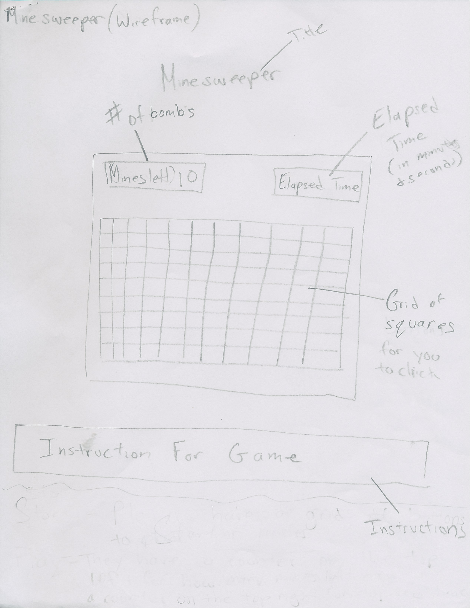
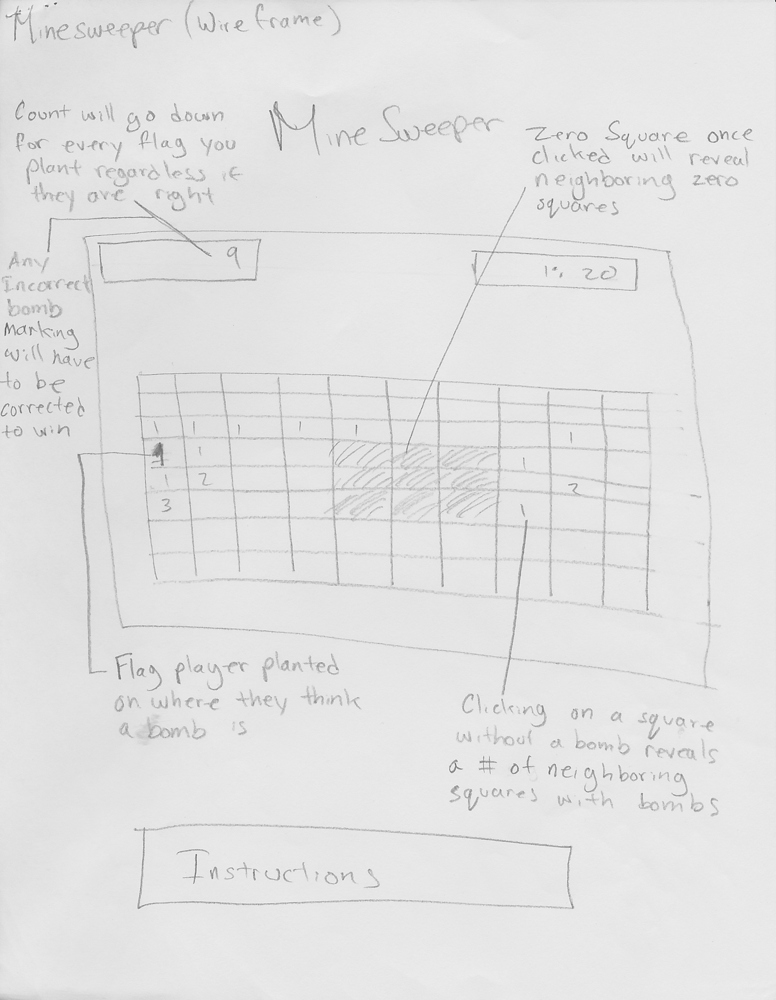
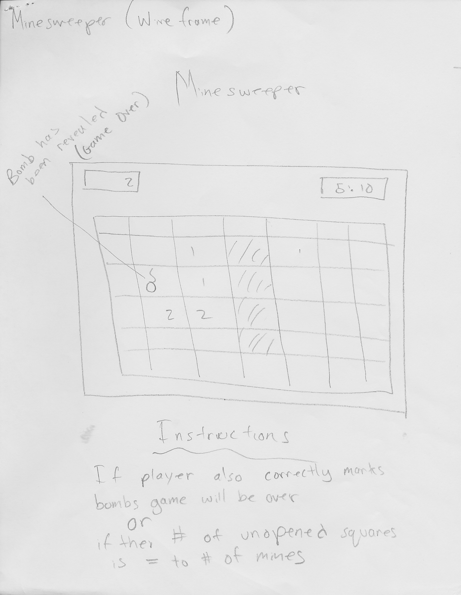

# Minesweeper
 
Link to Minesweeper: https://pages.git.generalassemb.ly/emuhit/Minesweeper/
 
## **Tech Used**
 
·   *JQuery:* A JavaScript library that made it easier to traverse the DOM.
 
·   *JQuery modal:* A design for the modals I used for the game.  I liked this one for it's simple look.
 
·   *VS Code:*  A text/code editor I used to make the code for Minesweeper.
 
·   *Laptop:* A portable computer that housed the local version of Minesweeper, for me to edit, play around with before push it onto github.
 
 
## **Wireframes**
 

 
## **Additional Information**
 
### **Approach Taken**

The approach I took was to was to take everything one at a time. I made sure every new function worked and didn't break any previous functions before moving on.  I would push to my github repository every two to three hours of working on Minesweeper.

### **Differences Between Wireframes and Current Version**

·   *Click on a 0 does not reveal all neighboring 0s.*  I believe that having  all the 0s reveal neighboring 0s would make the game a bit too easy.
 
·   *No Elapsed Time.* I did not want to rush the player to play this game.  It is a game that you need time to think about where you are going to click next.
 
·   *Flags do not decrease the mines amount on the top of the page.* Like the reason for the 0 reveal, I believe this would make the game easier
 
·   *Tracking wins and losses.*  Since I have the game generate a new board every time you win or you lose, I thought it would be nice to show you how many times you won or lost.

### **Lingering Issues**

·   *Columns and Rows must be the same.*  I originally wanted it so that columns and rows can be different, but I believe that somewhere in my code that column and rows are reversed,  so the game breaks if they are different.

### Installation Process
·    Fork the Minesweeper repo into your own GitHub account

·    Clone that repo into your own personal computer/laptop